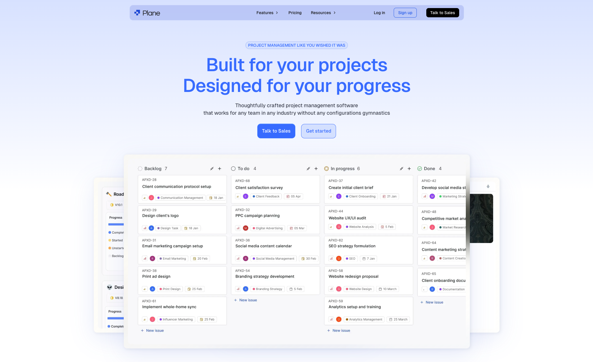
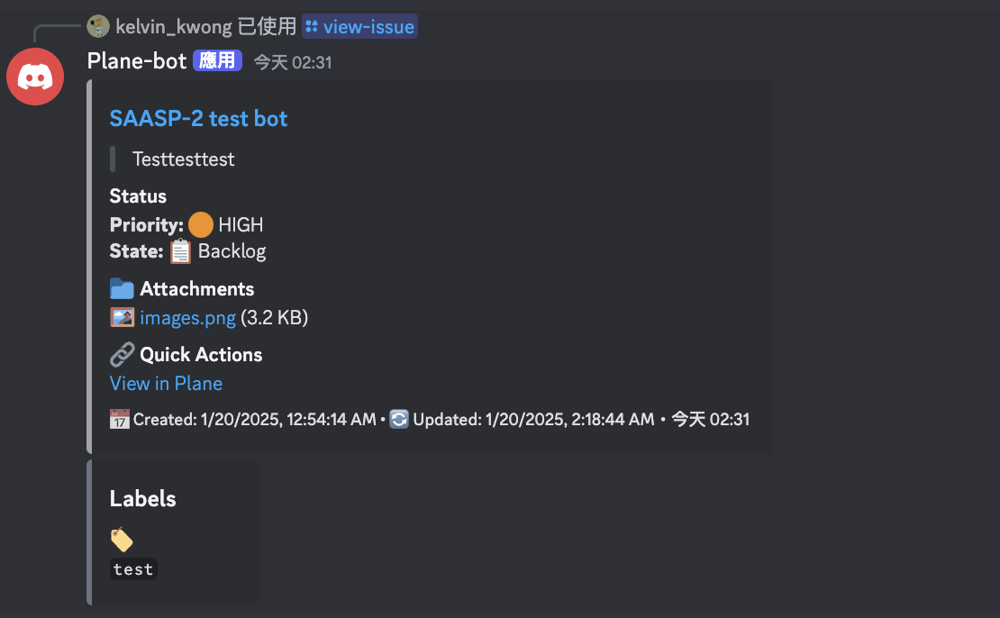
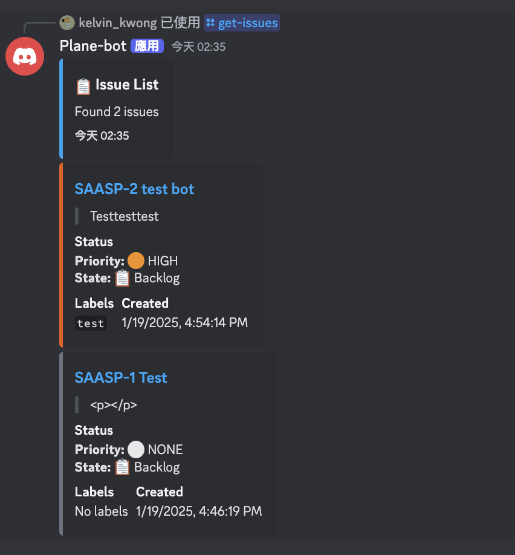

# Plane Discord Bot

A Discord bot that integrates with [Plane](https://plane.so), an open-source project planning tool. This bot allows you to manage Plane issues directly from Discord with rich visual embeds and interactive features.


## Plane Interface



The bot integrates with Plane's modern and intuitive interface, allowing you to manage your projects seamlessly between Discord and Plane's web interface. Above is an example of Plane's project management view, showcasing its clean design and powerful features.

## Interface Examples

### View Issue Command



```
/view-issue
Shows issue details with:
• Title and ID
• Priority with color indicators (🔴 HIGH, 🟠 MEDIUM, etc.)
• State with icons (📋 Backlog, ✅ Done, etc.)
• Attachments with previews
• Labels
• Creation and update timestamps
```

### Get Issues Command



```
/get-issues
Lists issues with:
• Summary of total issues found
• Individual issue cards
• Priority and state indicators
• Labels and timestamps
• Quick links to Plane
```

## Features

- Create new issues with title, description, and priority
- List issues with filtering by state and priority
- View detailed issue information with rich embeds
- Color-coded priority levels (🔴 Urgent, 🟠 High, 🟡 Medium, 🟢 Low)
- Support for issue labels and attachments
- Automatic state tracking with visual indicators
- Beautiful Discord embeds with formatted descriptions
- Direct integration with Plane's API

## Prerequisites

- Node.js v16.9.0 or higher
- A Discord bot token and application
- A [Plane](https://plane.so) account with API access
  - Workspace created
  - Project set up
  - API key generated

## Setup

1. Clone the repository

```bash
git clone <repository-url>
cd plane-discord-bot
```

2. Install dependencies

```bash
npm install
```

3. Configure environment variables
   Create a `.env` file in the root directory with the following variables:

```env
DISCORD_TOKEN=your_discord_bot_token
PLANE_API_KEY=your_plane_api_key        # Generate from Plane settings
WORKSPACE_SLUG=your_workspace_slug      # Found in Plane workspace URL
PROJECT_ID=your_project_id             # Found in Plane project settings
CLIENT_ID=your_discord_client_id
```

4. Deploy slash commands

```bash
npm run deploy
```

5. Start the bot

```bash
npm start
```

## Available Commands

### `/create-issue`

Create a new issue in Plane

- Options:
  - `title` (required): Issue title
  - `description` (required): Issue description
  - `priority` (required): Priority level
    - 🔴 Urgent
    - 🟠 High
    - 🟡 Medium
    - 🟢 Low

### `/get-issues`

List issues with optional filters

- Options:
  - `state`: Filter by state name (e.g., Backlog, In Progress, Done)
  - `priority`: Filter by priority level
    - 🔴 Urgent
    - 🟠 High
    - 🟡 Medium
    - 🟢 Low

### `/view-issue`

View detailed information about a specific issue

- Options:
  - `id` (required): The sequence ID of the issue (e.g., PROJ-123)

## Visual Features

- Priority-based color coding:

  - Urgent: Bright Red (#DC2626)
  - High: Bright Orange (#EA580C)
  - Medium: Golden Yellow (#CA8A04)
  - Low: Green (#16A34A)
  - None: Gray (#6B7280)

- Rich embeds with:
  - Issue title and ID
  - Formatted description
  - State information with Plane's workflow states
  - Priority level
  - Labels
  - Creation date
  - Direct link to Plane issue
  - Attachment information

## Integration Details

The bot integrates with Plane using their REST API:

- Automatic state synchronization
- Real-time issue creation and updates
- Support for Plane's custom states and workflows
- Direct links to Plane's web interface
- Cached state and label information for better performance

## Development

For development with hot-reloading:

```bash
npm run dev
```

## Docker Support

Build the container:

```bash
docker build -t plane-discord-bot .
```

Run with Docker:

```bash
docker run -d \
  --name plane-bot \
  --restart unless-stopped \
  -e DISCORD_TOKEN=your_discord_token \
  -e PLANE_API_KEY=your_plane_api_key \
  -e WORKSPACE_SLUG=your_workspace_slug \
  -e PROJECT_ID=your_project_id \
  -e CLIENT_ID=your_discord_client_id \
  plane-discord-bot
```

## Contributing

1. Fork the repository
2. Create your feature branch (`git checkout -b feature/amazing-feature`)
3. Commit your changes (`git commit -m 'Add some amazing feature'`)
4. Push to the branch (`git push origin feature/amazing-feature`)
5. Open a Pull Request

## License

This project is licensed under the MIT License - see the [LICENSE](LICENSE) file for details.

## Links

- [Plane Website](https://plane.so)
- [Plane API Documentation](https://developers.plane.so)
- [Discord.js Documentation](https://discord.js.org)
